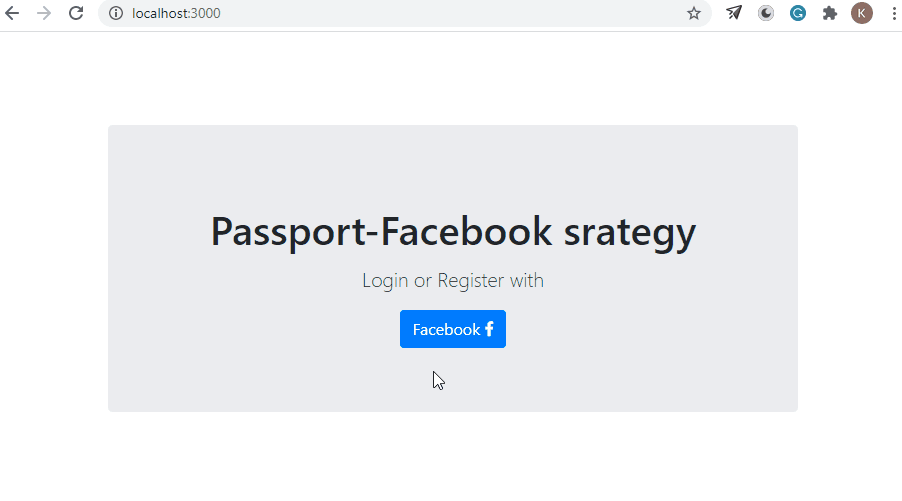
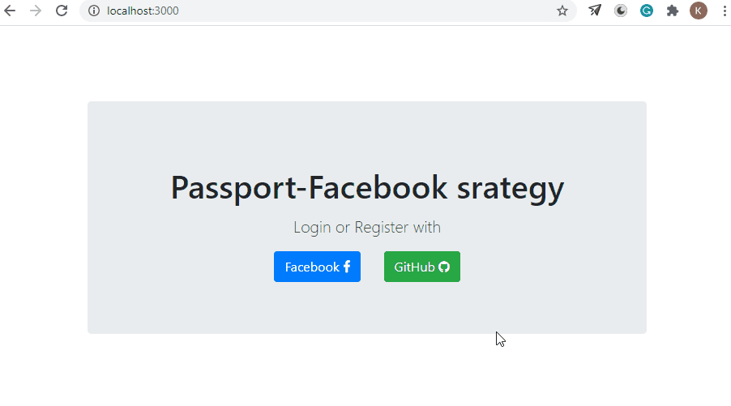

# Oauth-facebook-github-example 
Login with facebook and github example in Node.Js with passportJS 

Create .env file with facebook's and github's credentials to run this project. 

## Facebook OAuth

 

--------------------------------------------------------------------------------------------- 

## Github OAuth

